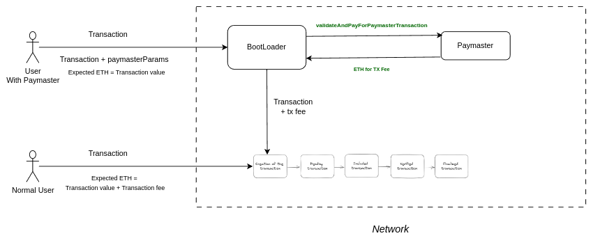
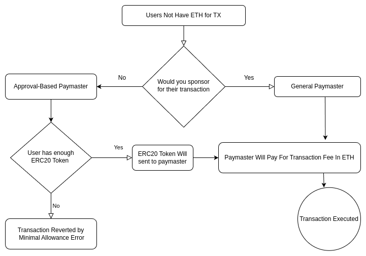

# Paymaster And Batch Transactions

## Overview

This sub-directory presents a Proof of Concept (PoC) showcasing the implementation of **Paymaster** functionalities and **Batch transactions** on the zkSync network. Explore deployment scripts and detailed flows to understand the capabilities and interactions within the zkSync network for efficient and scalable transactions.

## Paymaster

**Paymasters in zkSync** allow for fee compensation and ERC20 token fee payments, enhancing user experience and flexibility. Users interacting with a paymaster should provide the non-zero paymaster address in their EIP712 transaction.

#### _Two built-in flow:_

### General Paymaster

`[Insert General Paymaster Flow Diagram Here]`

#### High-Level Explanation

### Technical Details

[Provide technical details about the General Paymaster implementation, focusing on key functions, validations, and interactions with other contracts.]

## Approval Paymaster

### Flow Diagram

plaintextCopy code

`[Insert Approval Paymaster Flow Diagram Here]`

### High-Level Explanation

[Explain the high-level flow of the Approval Paymaster, detailing how it handles approvals and facilitates transactions.]

### Technical Details

[Provide technical details about the Approval Paymaster implementation, including how it manages approvals and processes transactions.]

## Multicall

### Flow Diagram

plaintextCopy code

`[Insert Multicall Flow Diagram Here]`

### High-Level Explanation

[Give a high-level overview of the Multicall functionality, explaining how it aggregates multiple function calls.]

### Technical Details

[Provide technical details about the Multicall implementation, focusing on the structure, handling of calls, and compatibility with different call types.]

## Deployment Scripts

### Approval Paymaster Deployment

[Include information about the script responsible for deploying the Approval Paymaster contract.]

### General Paymaster Deployment

[Include information about the script responsible for deploying the General Paymaster contract.]

### Multicall Deployment

[Include information about the script responsible for deploying the Multicall contract.]

## Interacting with Contracts

### Approval Paymaster Interaction Script

[Provide an example script demonstrating how to interact with the Approval Paymaster.]

### General Paymaster Interaction Script

[Provide an example script demonstrating how to interact with the General Paymaster.]

### Multicall Interaction Script

[Provide an example script demonstrating how to interact with the Multicall contract.]

## Dependencies

[Specify any external dependencies or libraries required to run the project.]

## Getting Started

[Include instructions on how to set up and run the project.]
