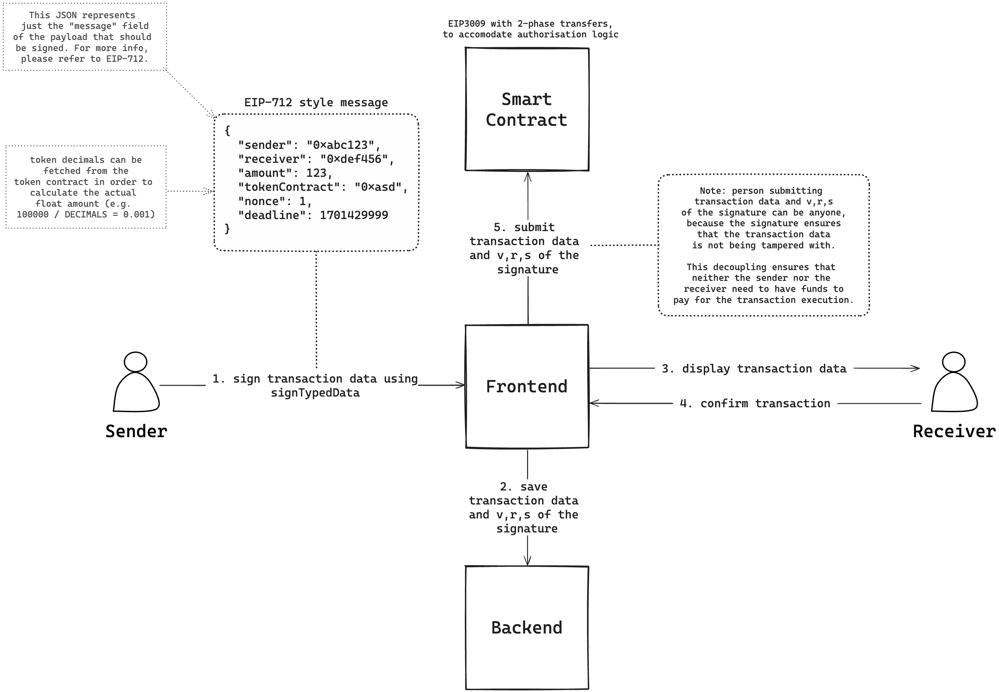

# Transaction with Authorizations

## Proposal

We propose using an upgraded version of `EIP-3009`, with accomodates for the custom authorization logic.

### Why `EIP-3009`?

- It saves gas for both parties:
  - `sender` only needs to sign a message (conforming to `EIP-712`)
  - `receiver` (can, but) doesn't have to submit transaction in their name in order for it to go through.
- Anyone can trigger the transfer using the transaction data and the signature's `v`, `r`, `s` fields,
  - Those fields in combination ensure that the transaction is not being tampered with and that the desired outcome will be reached,
  - This allows for any 3rd party to pay for the transaction execution.

There are two key functions in the `EIP-3009` contract, which handle the transfer execution:

- `transferWithAuthorization` allows anyone to submit the transaction data and the `v`, `r`, `s` fields, which will be verified, and if correct, the transfer will be executed.
- `receiveWithAuthorization` allows `receiver` perform `transferWithAuthorization`, with one additional check of the `msg.sender` (`msg.sender == receiver`)

### Transfer authorization

To accomodate for authorization feature, we propose customizing `EIP-3009` with the following:

- `transferWithAuthorization`:
  - Perform all the necessary checks of transaction data and the signature fields
  - If everything's alright, place the transfer in the `pending` state (either in a `mapping` or some equivalent data structure in the smart contract)
- `acceptTransfer`:
  - Check if the `msg.sender` is authorized to accept the transfer (`msg.sender == receiver`)
  - If true, execute the transfer
- `rejectTransfer`:
  - Check if the `msg.sender` is authorized to reject the transfer (`msg.sender == receiver`)
  - If true, delete the transfer from `pending` state

`receiveWithAuthorization` will remain the same, because only the `receiver` can trigger it and since they manually did that, it is assumed that they've accepted the transfer and `pending` state will be skipped.

TODO: detailed specification of how the funds will be manipulated (e.g. if funds will be locked until the `deadline`, how will the funds be unlocked etc)



## Notes

### [EIP-3009](https://eips.ethereum.org/EIPS/eip-3009)

- Unfortunately, still in `Draft` status and no work has been put into it for over 3 years, but there were attempts by the Circle's engineers to make it public in 2020.
- It heavily relies on `ECRecover` to validate signatures, but `ECRecover` is highly discouraged by `zksolc` due to native AA being available, where smart accounts could cause some unintended behaviors in `ECRecover`.
  - `zksolc`'s warning message:

```
┌──────────────────────────────────────────────────────────────────────────────────────────────────┐
│ Warning: It looks like you are using 'ecrecover' to validate a signature of a user account.      │
│ zkSync Era comes with native account abstraction support, therefore it is highly recommended NOT │
│ to rely on the fact that the account has an ECDSA private key attached to it since accounts might│
│ implement other signature schemes.                                                               │
│ Read more about Account Abstraction at https://v2-docs.zksync.io/dev/developer-guides/aa.html    │
└──────────────────────────────────────────────────────────────────────────────────────────────────┘
```

- However, if we assume that ECDSA is the go-to signature verification scheme for 99% of the wallets at the time of writing this note, EIP-3009 could be paired well with [OpenZeppelin's `SignatureChecker`](https://github.com/OpenZeppelin/openzeppelin-contracts/blob/v5.0.0/contracts/utils/cryptography/SignatureChecker.sol) to accommodate for Smart Wallets as well.

- More links:
  - [EIP-3009 repo](https://github.com/CoinbaseStablecoin/eip-3009) by Coinbase Stablecoin team
  - [PR on Ethereum's Github](https://github.com/ethereum/EIPs/issues/3010)
  - [PR on OpenZeppelin's Github](https://github.com/OpenZeppelin/openzeppelin-contracts/issues/2436)
  - [OpenZeppelin's `SignatureChecker`](https://github.com/OpenZeppelin/openzeppelin-contracts/blob/v5.0.0/contracts/utils/cryptography/SignatureChecker.sol)
  - [Alchemy's blogpost on Smart Account signature verification](https://docs.alchemy.com/docs/how-to-make-your-dapp-compatible-with-smart-contract-wallets)
